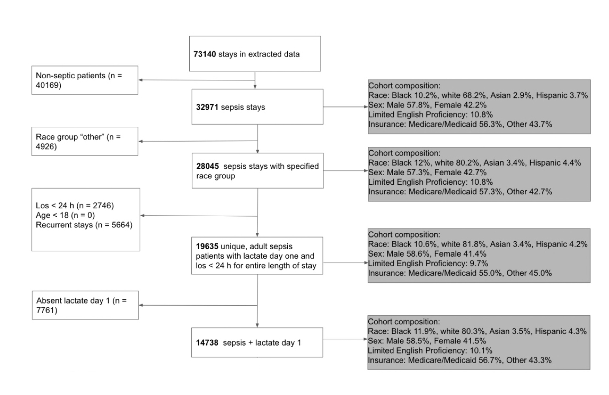

# Consort Diagram
Use case for python package that generates a consortium diagram from a data frame. 

The code in this repository includes the helper functions .get_demography(df) and .print_demo(demo) that, based on the way I've been creating cohort selections and consort diagrams so far in my data science journey, would be nice to compress into a python package. Beyond this, having a way to install a package enabling consort diagram plot generation based on a data frame alone would be very time-consuming for me compared to how I usually make consort diagrams. 

